Plotting in R
========================================================
author: SANJAY KHADAYATE
date: 02/02/2015

========================================================

1.  Introduction

2.	Base graphics
  + Line Charts
  + Bar Charts
  + Histograms
  + Pie Charts
  + Dot charts
  + Combining Plots
     
3.  Saving your plot

4.	Lattice R package

5.	ggplot2 R package


Introduction
========================================================
R has excellent graphics and plotting capabilities. They are mostly found in following three sources.
 + base graphics
 + the lattice package
 +  the ggplot2 package
 
Lattice and ggplot2 packages are built on grid graphics package while the base graphics routines adopt a pen and paper model for plotting.


Base Graphics
========================================================
+ Line Charts

First we'll produce a very simple graph using the values in the treatment vector:


```r
treatment <- c(0.02,1.8, 17.5, 55,75.7, 80)
```

Plot the treatment vector with default parameters


```r
plot(treatment)
```

Line Plot
========================================================

 

=======================================================
Now, let's add a title, a line to connect the points, and some color:

Plot treatment using blue points overlayed by a line


```r
plot(treatment, type="o", col="blue")
```
Create a title with a red, bold/italic font

```r
title(main="Treatment", col.main="red", font.main=4)
```

Line Plot
========================================================
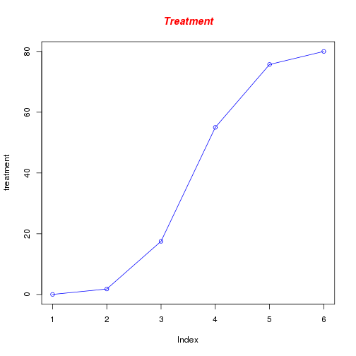 

========================================================
Now let's add a red line for a control vector and specify the y-axis range directly so it will be large enough to fit the data:

Define control vector

```r
control <- c(0, 20, 40, 60, 80,100)
```

Plot treatment using a y axis that ranges from 0 to 100

```r
plot(treatment, type="o", col="blue", ylim=c(0,100))
```
Plot control with red dashed line and square points

```r
lines(control, type="o", pch=22, lty=2, col="red")
```


==========================================================

Create a title with a red, bold/italic font

```r
title(main="Expression Data", col.main="red", font.main=4)
```

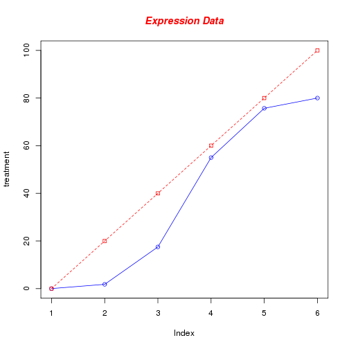 

==========================================================

Next let's change the axes labels to match our data and add a legend. 
We'll also compute the y-axis values using the max function 
so any changes to our data will be automatically 
reflected in our graph. 

Calculate range from 0 to max value of data

```r
g_range <- range(0, treatment, control)
```

range returns a vector containing the minimum and maximum of all the given arguments.

Plot treatment using y axis that ranges from 0 to max value in treatment or control vector.  Turn off axes and annotations (axis labels) so we can specify them ourselves.

========================================================


```r
plot(treatment, type="o", col="blue", ylim=g_range,axes=FALSE, ann=FALSE)
```

Make x axis using labels


```r
axis(1, at=1:6, lab=c("Mon","Tue","Wed","Thu","Fri","Sat"))
```

Make y axis with horizontal labels that display ticks at every 20 marks. 


```r
axis(2, las=1, at=20*0:g_range[2])
```

Create box around plot


```r
box()
```

========================================================

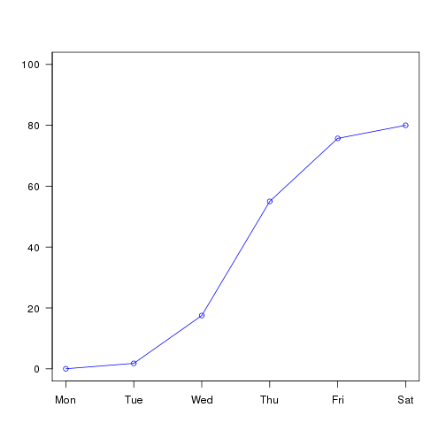 

========================================================
Calculate range from 0 to max value of data

```r
g_range <- range(0, treatment, control)
```

range returns a vector containing the minimum and maximum of all the given arguments.

Plot treatment using y axis that ranges from 0 to max value in treatment or control vector.  Turn off axes and annotations (axis labels) so we can specify them ourselves.


```r
plot(treatment, type="o", col="blue", ylim=g_range,axes=FALSE, ann=FALSE)
```

========================================================

Make x axis using labels

```r
axis(1, at=1:6, lab=c("Mon","Tue","Wed","Thu","Fri","Sat"))
```

Make y axis with horizontal labels that display ticks at every 20 marks. 


```r
axis(2, las=1, at=20*0:g_range[2])
```

Create box around plot

```r
box()
```

========================================================

Plot control vector with red dashed line and square points


```r
lines(control, type="o", pch=22, lty=2, col="red")
```

Create a title with a red, bold/italic font

```r
title(main="Data", col.main="red", font.main=4)
```

Label the x and y axes with dark green text

```r
title(xlab="Days", col.lab=rgb(0,0.5,0))
title(ylab="Values", col.lab=rgb(0,0.5,0))
```

========================================================

Create a legend at (1, g_range[2]) that is slightly smaller (cex) and uses the same line colors and points used by the actual plots 


```r
legend(1, g_range[2], c("treatment","control"), cex=0.8, col=c("blue","red"), pch=21:22, lty=1:2);  
```

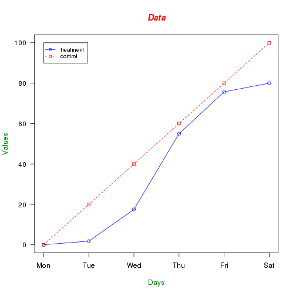 
 	
	
========================================================	
	
Bar Charts
Let's start with a simple bar chart graphing the treatment vector: 
Plot treatment


```r
barplot(treatment)
```

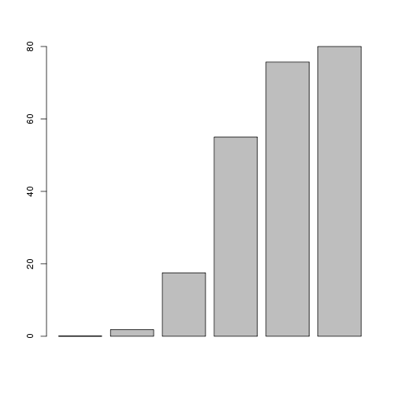 

========================================================
 
Let's now read the data from the example.txt data file, add labels, blue borders around the bars, and density lines: 

Read values from tab-delimited example.txt

```r
data <- read.table("example.txt", header=T, sep="\t")
```

Plot treatment with specified labels for axes.  Use blue borders and diagonal lines in bars.


```r
barplot(data$treatment, main="Treatment", xlab="Days",ylab="values", names.arg=c("Mon","Tue","Wed","Thu","Fri","Sat"),  border="blue", density=c(10,20,30,40,50,60))
```


========================================================

names.arg  is a vector of names to be plotted below each bar or group of bars. 
density	a vector giving the density of shading lines, in lines per inch, for the bars or bar components.

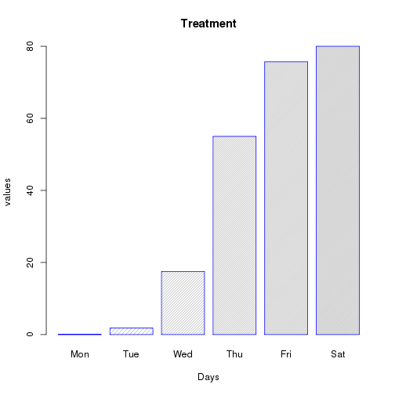 

========================================================	
Now let's plot the treatment data using some color and show a legend: 

   
Graph data with adjacent bars using colors


```r
barplot(as.matrix(data), main="Data", ylab= "Total", beside=TRUE, col= c("lightblue", "mistyrose", "lightcyan","lavender", "cornsilk","maroon"))
```

Place the legend at the top-left corner with no frame


```r
legend("topleft", c("Mon","Tue","Wed","Thu","Fri","Sat"), cex=0.8,bty="n", 
fill=  c("lightblue", "mistyrose", "lightcyan","lavender", "cornsilk","maroon"));
```

========================================================

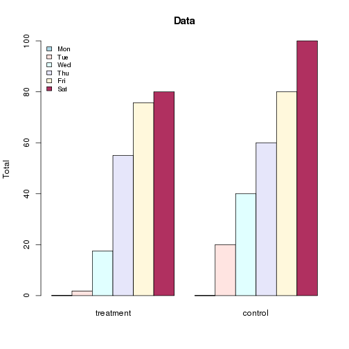 

========================================================	
Histograms
Let's start with a simple histogram plotting the distribution of the treatment vector: 

Create a histogram for treatment

```r
hist(treatment)	
```

 

========================================================

Concatenate the three vectors


```r
all <- c(data$control, data$treatment)
```

Create a histogram for data in light blue with the y axis ranging from 0-10

```r
hist(all, col="lightblue", ylim=c(0,10))
```

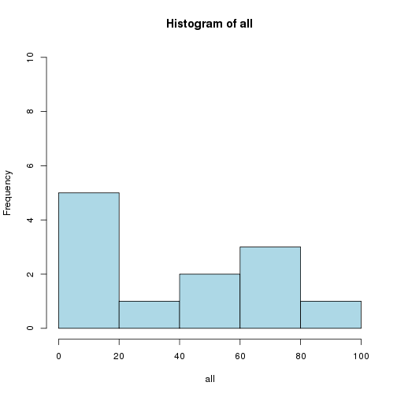 

======================================================== 	

Now change the breaks so none of the values are grouped together and flip the y-axis labels horizontally. 

Compute the largest value used in the data


```r
max_num <- max(all)
```

Create a histogram for data with fire colors, set breaks so each number   is in its own group, make x axis range from 0-max_num, disable right-closing  of cell intervals, set heading, and make  y-axis labels horizontal.

========================================================


```r
hist(all, col=heat.colors(max_num), breaks=max_num, xlim=c(0,max_num), right=F, 
main="Histogram", las=1)	
```

breaks: a single number giving the number of cells for the histogram,
An open interval does not include its endpoints, and is indicated with parentheses.

For example (0,1) means greater than 0 and less than 1. 

A closed interval includes its endpoints, and is denoted with square brackets. 
For example [0,1] means greater than or equal to 0 and less than or equal to 1.


========================================================

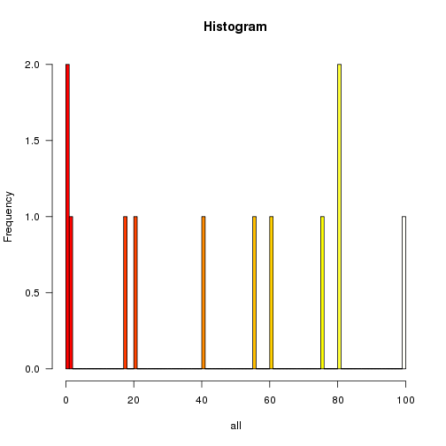 

========================================================

Now let's create uneven breaks and graph the probability density. 

 Create uneven breaks

```r
brk <- c(0,30,40,50,60,80,100)
```

Create a histogram for all data with fire colours, set uneven breaks, make x axis range from 0-max_num, disable right-closing of cell intervals,  set heading, make y-axis labels horizontal, make axis labels smaller, make areas of each column proportional to the count

========================================================


```r
hist(all, col=heat.colors(length(brk)), breaks=brk,xlim=c(0,max_num), right=F, main="Probability Density",las=1, cex.axis=0.8, freq=F)
```

 		
freq	logical; 
if TRUE, the histogram graphic is a representation of frequencies

if FALSE, probability densities, component density, are plotted

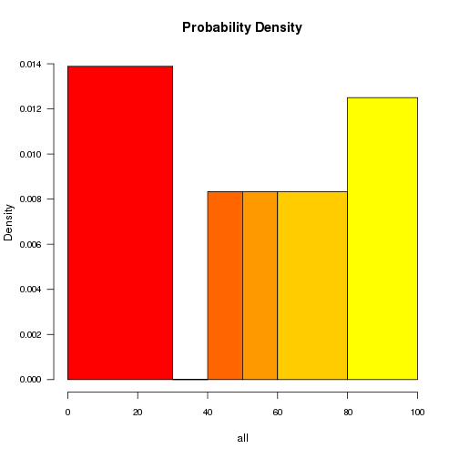 


========================================================
Pie Charts
Let's start with a simple pie chart graphing the treatment vector: 
 Create a pie chart for treatment

```r
pie(treatment)
```

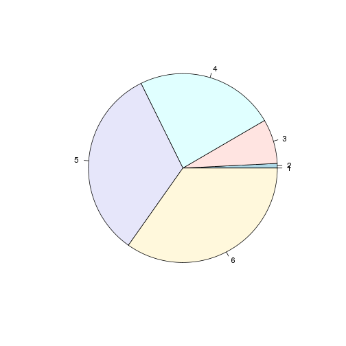 

========================================================

Now let's add a heading, change the colours, and define our own labels: 

Create a pie chart with defined heading and  custom colours and labels

```r
pie(treatment, main="Treatment", col= c("lightblue", "mistyrose", "lightcyan","lavender", "cornsilk","maroon"),
    labels=c("Mon","Tue","Wed","Thu","Fri","Sat"))	
```

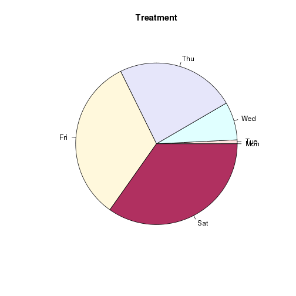 

========================================================

Now let's change the colours, label using percentages, and create a legend: 
Define some colours ideal for black & white print

```r
colors <- c("white","grey70","grey90","grey50","black")
```

Calculate the percentage for each day, rounded to one decimal place

```r
treatment_labels <- round(treatment/sum(treatment) * 100, 1)
```

Concatenate a '%' char after each value

```r
treatment_labels <- paste(treatment_labels, "%", sep="")
```

========================================================

Create a pie chart with defined heading and custom colors and labels


```r
pie(treatment, main="treatment", col=colors, labels= treatment_labels,cex=0.8)
```

Create a legend at the right   

```r
legend(1.5, 0.5, c("Mon","Tue","Wed","Thu","Fri","Sat"), cex=0.8,fill=colors)	
```

========================================================

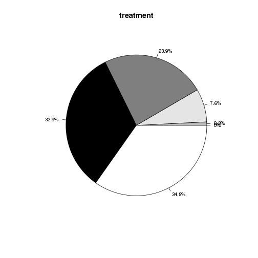 

========================================================
Dot charts
Let's start with a simple dot chart graphing the data: 

Create a dot chart for data
Function t returns the transpose of a matrix.

```r
dotchart(t(data))	
```

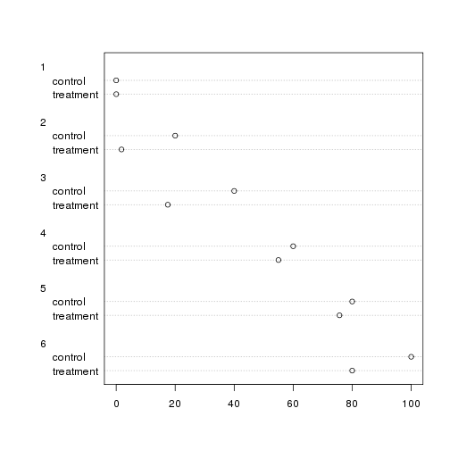 

========================================================

Let's make the dotchart a little more colorful: 

Create a colored dotchart for autos with smaller labels

```r
dotchart(t(data), color=c("red","blue","darkgreen"),main="Dotchart", cex=0.8)	
```

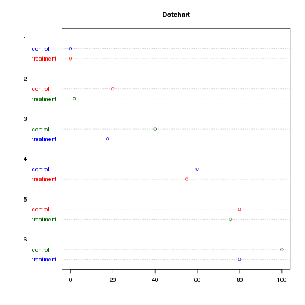 

Combining Plots
======================================================== 


R makes it easy to combine multiple plots into one overall graph, using either the par( ) or layout( ) function. 
With the par( ) function, you can include the option mfrow=c(nrows, ncols) to create a matrix of nrows x ncols plots that are filled in by row.
mfcol=c(nrows, ncols) fills in the matrix by columns.

Define a layout with 2 rows and 2 columns


```r
par(mfrow=c(2,2))
```


========================================================

Here, we will use different dataset with two columns each for treated and untreated samples.


```r
data1 <- read.table("gene_data.txt", header=T, sep="\t")
head(data1)
```

```
     ensembl_gene_id Untreated1 Untreated2 Treated1 Treated2
1 ENSDARG00000093639     0.8617     1.9311   0.1042   0.1406
2 ENSDARG00000094508     0.9858     2.0256   0.1550   0.2030
3 ENSDARG00000095893     0.8499     1.9876   0.2318   0.2093
4 ENSDARG00000095252     0.9243     2.0858   0.2562   0.2467
5 ENSDARG00000078878     0.3572     0.4654   0.1167   0.0971
6 ENSDARG00000079403     1.0604     1.2581   0.3885   0.3157
```

========================================================

Plot histograms for different columns in the data frame separately. This is not very efficient. you would see how to do it more efficiently using for loop later on.


```r
hist(data1$Untreated1)
hist(data1$Treated2)
hist(data1$Untreated2)
boxplot(data1$Treated1)
```

========================================================

 
 

========================================================

 

========================================================

 

========================================================

 

Saving your plots
========================================================


There are many different ways of saving your plots in R. 

The only argument you would need is name of file in which you want to save the plot.

Plotting commands then can be entered as usual.
The output would be redirected to the file. 

When you're done with your plotting commands, enter the dev.off() command. 


```r
bmp(filename, width = 480, height = 480, units = "px", point-size = 12)
jpeg(filename, width = 480, height = 480, units = "px", point-size = 12, quality = 75)
```

========================================================

Saving in bitmap format

```r
bmp(file = "control.bmp")
plot(control)
dev.off()
```

Saving in jpeg format

```r
jpeg(file = "control.jpg", quality = 20)
plot(control)
dev.off()
```

========================================================

Saving in postscript format


```r
postscript(file = "control.ps")
plot(control)
dev.off()
```


```r
saving in pdf format
pdf(file = "control.pdf", paper = "A4")
plot(control)
dev.off()
```

Lattice R package
========================================================


Lattice is an excellent package for visualizing multivariate data. 
It has great set of routines for quickly displaying complex data sets with ease. 

Advantages of using lattice package are as following.

Plots with lattice package usually look better.

They can be extended in powerful ways.

The resulting output can be annotated, edited and saved.

========================================================

Basic form for lattice function call is function.name (formula).

The general arrangement of a formula in a lattice function is:
           vertical.axis.variable ~ horizontal.axis.variable
           
Note that the tilde operator (i.e., ~) must be used in a lattice function call, even if the graph only   uses a single variable.

For e.g., histogram(~data$x),  xyplot(data$y ~ data$x)

========================================================

Some of the functions available in lattice package are as following:
Graphs for univariate data

histogram(), densityplot(),bwplot()

Graphs for showing quantiles of one or more distributions

qqmath(),qq()

Two-dimensional data

xyplot() for creating scatterplots

========================================================

Let’s start by loading the lattice package. 


```r
library(lattice)
```

Read the data from file named gene_data.txt

```r
data <- read.table("gene_data.txt", header=T, sep="\t")
```

A simple scatter plot can be produced as,

```r
xyplot(Untreated2~Treated2, data=data)
```

========================================================

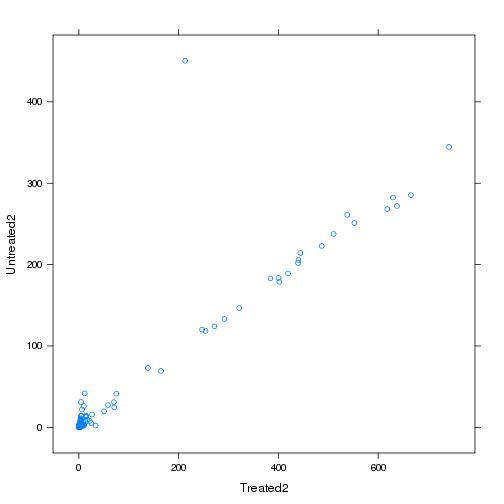 


========================================================

or the output can be redirected to an object as, 

```r
tplot<-xyplot(Untreated2~Treated2, data=data)
```

and then printed as, 

```r
print(tplot)
```

 

The object containing the plot can further be modified. for e.g.

```r
tplot2<-update(tplot, main="Drug treatment  in Cells" )
               
print(tplot2)
```

========================================================

Box and whisker plot can be produced with bwplot function. Here, we are again using a singer data frame which is bundled with lattice package. You would have to load lattice package first before using this database.


```r
head(singer)
```

```
  height voice.part
1     64  Soprano 1
2     62  Soprano 1
3     66  Soprano 1
4     65  Soprano 1
5     60  Soprano 1
6     61  Soprano 1
```


```r
bwplot(voice.part ~ height, data=singer, xlab="Height (inches)")
```

========================================================

A density plot can be drawn with densityplot function.

```r
densityplot( ~ height | voice.part, data = singer, layout = c(2, 4), xlab = "Height (inches)", bw = 5)
```


qqmath function is used to draw quantile-Quantile plots of a sample against a theoretical distribution.

```r
qqmath(~ rnorm(100), distribution = function(p) qt(p, df = 10))
```

ggplot2 R package
========================================================

Let's look at how to create a scatterplot in ggplot2. We'll use the iris data frame that's automatically loaded into R.
What does the data frame contain? We can use the head function to look at the first few rows

```r
head(iris, n = 3)  
```

```
  Sepal.Length Sepal.Width Petal.Length Petal.Width Species
1          5.1         3.5          1.4         0.2  setosa
2          4.9         3.0          1.4         0.2  setosa
3          4.7         3.2          1.3         0.2  setosa
```

========================================================

 by default, head displays the first 6 rows. 

```r
head(iris, n = 10)    
```

 we can also explicitly set the number of rows to display

(The data frame actually contains three types of species: setosa, versicolor, and virginica.)

========================================================
Let's plot Sepal.Length against Petal.Length using ggplot2's qplot() function.

```r
qplot(Sepal.Length, Petal.Length, data = iris)
```

Plot Sepal.Length vs. Petal.Length, using data from the `iris` data frame.
First argument `Sepal.Length` goes on the x-axis.
Second argument `Petal.Length` goes on the y-axis.
 `data = iris` means to look for this data in the `iris` data frame.    

 

To see where each species is located in this graph, we can color each point by adding a color = Species argument.

```r
qplot(Sepal.Length, Petal.Length, data = iris, color = Species) 
```

========================================================
 
Similarly, we can let the size of each point denote petal width, by adding a size = Petal.Width argument.

```r
qplot(Sepal.Length, Petal.Length, data = iris, color = Species, size = Petal.Width)
```

We see that Iris setosa flowers have the narrowest petals.
 
Finally, let's fix the axis labels and add a title to the plot.

```r
qplot(Sepal.Length, Petal.Length, data = iris, color = Species, xlab = "Sepal Length", ylab = "Petal Length", main = "Sepal vs. Petal Length in Fisher's Iris data")
```


Other common geoms
========================================================


In the scatterplot examples above, we implicitly used a point geom, the default when you supply two arguments to qplot().
These two invocations are equivalent.


```r
qplot(Sepal.Length, Petal.Length, data = iris, geom = "point")
qplot(Sepal.Length, Petal.Length, data = iris)
```

But we can also easily use other types of geoms to create more kinds of plots.
Barcharts: geom = "bar"


========================================================

Let’s construct a data frame called movies.

```r
movies = data.frame(
    director = c("spielberg", "spielberg", "spielberg", "jackson", "jackson"),
    movie = c("jaws", "avatar", "schindler's list", "lotr", "king kong"),
    minutes = c(124, 163, 195, 600, 187)
)
```

Plot the number of movies each director has.

```r
qplot(director, data = movies, geom = "bar", ylab = "# movies")
```

========================================================
By default, the height of each bar is simply a count. But we can also supply a different weight.
Here the height of each bar is the total running time of the director's movies.


```r
qplot(director, weight = minutes, data = movies, geom = "bar", ylab = "total length (min.)")
```

Line charts: geom = "line"
========================================================


```r
qplot(Sepal.Length, Petal.Length, data = iris, geom = "line", color = Species) 
```

`Orange` is another built-in data frame that describes the growth of orange trees.


```r
qplot(age, circumference, data = Orange, geom = "line", colour = Tree,
    main = "How does orange tree circumference vary with age?")
```

We can also plot both points and lines.

```r
qplot(age, circumference, data = Orange, geom = c("point", "line"), colour = Tree)
```

========================================================
References
Material used in this presentation has been compiled from following sources.

http://blog.echen.me/2012/01/17/quick-introduction-to-ggplot2/

http://www.his.sunderland.ac.uk/~cs0her/Statistics/UsingLatticeGraphicsInR.htm

http://polisci.msu.edu/jacoby/icpsr/graphics/lattice/Lattice, ICPSR 2012 Outline, Ver 1.pdf

http://streaming.stat.iastate.edu/workshops/r-intro/lectures/3-graphics.pdf

http://www.sr.bham.ac.uk/~ajrs/R/r-plot_data.html


