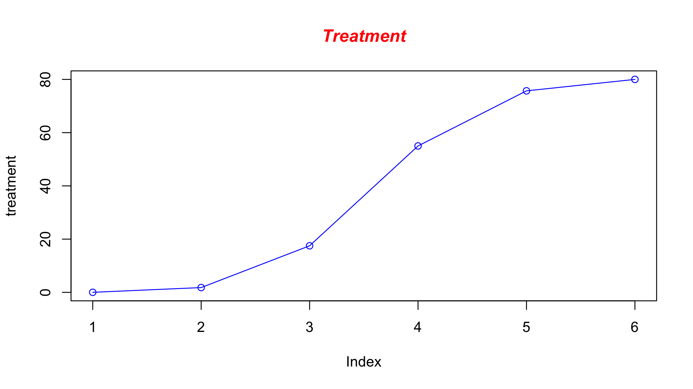

Introduction to R
========================================================
author: Thomas Carroll
date: Februrary 8th
width: 1440
height: 1100
autosize: true
font-import: <link href='http://fonts.googleapis.com/css?family=Slabo+27px' rel='stylesheet' type='text/css'>
font-family: 'Slabo 27px', serif;
css:style.css

What is R?
========================================================
**R** is scripting language and environment for **statistical computing**.

sqrt(25)-1

Developed by [Robert Gentleman](http://www.gene.com/scientists/our-scientists/robert-gentleman) and [Ross Ihaka](https://www.stat.auckland.ac.nz/~ihaka/). 


Inheriting much from its predecessor **S** (Bell labs).

- Open source & cross platform
- Suited to high level data analysis
- Extensive graphics capabilities
- Diverse range of add-on packages
- Active community of developers
- Thorough documentation

What is R to you?
========================================================

**R** comes with excellent "out-of-box" statistical and plotting capabilities.


**R** provides access to 1000s of packages ([CRAN](http://cran.r-project.org/)/[MRAN](http://mran.revolutionanalytics.com/)/[R-forge](https://r-forge.r-project.org/)) which extend the basic functionality of R while maintaining high quality documentation.


In particular, [Robert Gentleman](http://www.gene.com/scientists/our-scientists/robert-gentleman) developed the **[Bioconductor](http://bioconductor.org/)** project where 100s of packages are directly related to Biology and analysis of associated high-throughput experiments.


How to get R?
========================================================
left: 50%

Freely available from [R-project website](http://cran.ma.imperial.ac.uk/).

Rstudio provides extended GUI and is also freely available from [Rstudio site](http://www.rstudio.com/)


***We will be using Rstudio and R already installed on your machines.***
A quick tour of Rstudio
========================================================
left: 30%
Four main panels
- Scripting panel
- R interface
- Environment and History
- Files, directories and help


R Basics
========================================================
type:section

- Simple Calculations
- Intro to variables
- Vectors
- Lists
- Matrices
- Data frames


Simple Calculations 
========================================================
type: subsection
At its most basic, **R** can be used as a simple calculator.

```r
> 3+1
```

```
[1] 4
```

```r
> 2*2
```

```
[1] 4
```

```r
> sqrt(25)-1
```

```
[1] 4
```

Using functions 
========================================================

The **sqrt(25)** demostrates the use of functions in R.

A function performs a complex operation on it's arguments and returns the result.

In R, arguments are provided to R within the parenthesis that follows function name.

So **sqrt(*ARGUMENT*)** will provide the square root of value of ***ARGUMENT***.

Other examples of functions include **mean()**, **sum()**, **max()**.

```r
mean(2,4,6)
```

```
[1] 2
```

```r
sum(2,4,6)
```

```
[1] 12
```

```r
max(2,4,6)
```

```
[1] 6
```

Using functions.
========================================================

R has many useful functions "built in" and ready to use as soon as R is loaded.

An incomplete, illustrative list can be seen [here](http://www.columbia.edu/~cjd11/charles_dimaggio/DIRE/resources/R/rFunctionsList.pdf) 

In addition to R standard functions, additional functionality can be loaded into R using libraries. These include specialised tools for areas such as sequence alignment, read counting etc.

If you need to see how a function works try **?** infront of function name.

```r
?sqrt
```

More on functions and libraries soon!

Using functions.
========================================================

As with other programming languages and even graphical calculators, **R** makes use of **variables**.

A variable stores a value as a letter or word.

In R, we make use of the assignment operator **<-** 

```r
x <- 10
```
Now **x** holds the value of 10

```r
x
```

```
[1] 10
```

Variables. 
========================================================


```r
x
```

```
[1] 10
```
Variables can be altered in place

```r
x <- 20
x
```

```
[1] 20
```
Variables can be used just as the values they contain.

```r
x + sqrt(25)
```

```
[1] 25
```
Variables can be used to create new variables

```r
y <- x + sqrt(25)
y
```

```
[1] 25
```

Vectors.
========================================================
In **R** the most basic variable or data type is a "Vector". A vector is an ordered collection of values. The x and y variable we have previously assigned is an example of a vector of length 1.


```r
x
```

```
[1] 20
```

```r
length(x)
```

```
[1] 1
```

To create a multiple value vector we use the function **c()** to *combine* the supplied arguments into one vector.


```r
x <- c(1,2,3,4,5,6,7,8,9,10)
x
```

```
 [1]  1  2  3  4  5  6  7  8  9 10
```

```r
length(x)
```

```
[1] 10
```

Vectors of continuous stretches of values can be created by this shortcut.


```r
y <- 6:10
y
```

```
[1]  6  7  8  9 10
```

Vectors (Indexing)
========================================================
Square brackets **[]** identify the position within a vector (the **index**).
These indicies can be used to extract relevant values from vectors.

A vector is an ordered collection of values. The x and y variable we have previously assigned is an example of a vector of length 1.


```r
x
```

```
 [1]  1  2  3  4  5  6  7  8  9 10
```

```r
x[1]
```

```
[1] 1
```

```r
x[8]
```

```
[1] 8
```

Indicies can be used to extract values from a multiple positions within a vector.


```r
x[c(1,6)]
```

```
[1] 1 6
```
Negative indicies can be used to extract all positions except that specified


```r
x[-5]
```

```
[1]  1  2  3  4  6  7  8  9 10
```


Vectors (indexing)
========================================================

We can use indicies to modify a specific position in vector


```r
x
```

```
 [1]  1  2  3  4  5  6  7  8  9 10
```

```r
x[5] <- -5
x
```

```
 [1]  1  2  3  4 -5  6  7  8  9 10
```

Indicies can be specified using other vectors.


```r
y
```

```
[1]  6  7  8  9 10
```

```r
x[y]
```

```
[1]  6  7  8  9 10
```

```r
x[y] <- 0
x
```

```
 [1]  1  2  3  4 -5  0  0  0  0  0
```

Remember!
========================================================
type: exclaim
Square brackets **[]**  for indexing

```r
x[1]
```

```
[1] 1
```

Parentheses **()**  for function argments.

```r
sqrt(4)
```

```
[1] 2
```

Working with vectors
========================================================

Vectors in R can be used in arithmetic operations as seen with variables earlier.
When a standard arithmetic operation is applied to vector, the operation is applied to each position in a vector.


```r
x <- c(1,2,3,4,5,6,7,8,9,10)
x
```

```
 [1]  1  2  3  4  5  6  7  8  9 10
```

```r
y <- x*2
y
```

```
 [1]  2  4  6  8 10 12 14 16 18 20
```

Multiple vectors can be used within arithmetic operations. 

```r
x+y
```

```
 [1]  3  6  9 12 15 18 21 24 27 30
```

When applying an arithmetic operation between two vectors of unequal length, the shorter will be recycled.


```r
x+c(1,2)
```

```
 [1]  2  4  4  6  6  8  8 10 10 12
```


```r
x+c(1,2,3)
```

```
 [1]  2  4  6  5  7  9  8 10 12 11
```

Vectors can be made of character values
========================================================

So far we have only looked at numeric vectors.

In R we can also create character vectors again using **c()** function. These vectors can be indexed just the same.


```r
y <- c("ICTEM","CommonWealth","Wolfson")
y[2]
```

```
[1] "CommonWealth"
```

Character vectors can be used to assign names to other vectors.


```r
x <- c(1:3)
names(x) <- y
x
```

```
       ICTEM CommonWealth      Wolfson 
           1            2            3 
```

These named vectors maybe indexed a positions "name".

```r
x[c("ICTEM","Wolfson")]
```

```
  ICTEM Wolfson 
      1       3 
```
Index names missing from vectors will return special value "NA"

```r
x[c("Strand")]
```

```
<NA> 
  NA 
```


Vectors can be made of logical values
========================================================

Logical vectors are a special type of value made up of TRUE/T or FALSE/F


```r
z <- c(T,F,T,F,T,F,T,F,T,F) 
# z <-  c(TRUE,FALSE,TRUE,FALSE,TRUE,FALSE,TRUE,FALSE,TRUE,FALSE) 
z
```

```
 [1]  TRUE FALSE  TRUE FALSE  TRUE FALSE  TRUE FALSE  TRUE FALSE
```
Logical vectors can be used like an index to specify postions in a vector


```r
x <- 1:10
x[z]
```

```
[1] 1 3 5 7 9
```

Numeric vectors may be evaluated to produce logical vectors. This can be very useful when using a logical as an index
Common examples are:

- **==**  evaluates as equal.
- **>** and **<** evaluates as greater or less than respectively.


```r
x > 5
```

```
 [1] FALSE FALSE FALSE FALSE FALSE  TRUE  TRUE  TRUE  TRUE  TRUE
```

```r
x[x > 5]
```

```
[1]  6  7  8  9 10
```

More complex logicals
========================================================

Logical vectors can be used in combination to index vectors. To combine logical vectors we can use some common R operators.

- **&** Requires both logical evaluators to be TRUE
- **|** Requires either logical evaluator to be TRUE.
- **!** Reverses logical operator, so TRUE is FALSE and FALSE is TRUE.


```r
x <- 1:10
x > 4
```

```
 [1] FALSE FALSE FALSE FALSE  TRUE  TRUE  TRUE  TRUE  TRUE  TRUE
```

```r
!x > 4
```

```
 [1]  TRUE  TRUE  TRUE  TRUE FALSE FALSE FALSE FALSE FALSE FALSE
```

```r
x > 4 & x < 7
```

```
 [1] FALSE FALSE FALSE FALSE  TRUE  TRUE FALSE FALSE FALSE FALSE
```

```r
x > 4 | x < 7
```

```
 [1] TRUE TRUE TRUE TRUE TRUE TRUE TRUE TRUE TRUE TRUE
```

```r
x > 4 & !x < 7
```

```
 [1] FALSE FALSE FALSE FALSE FALSE FALSE  TRUE  TRUE  TRUE  TRUE
```

Such combinations can allow for complex selection of vector's values.

```r
x <- 1:10
x[x > 4 & x < 7]
```

```
[1] 5 6
```


Time for an exercise!
========================================================

- Create a vector called "Counts" containing values 4000,2000,3008,4089,1055
- Name this vector with gene names Pax5, Oct4, Sox2, Med2, Jrd2
- Create a vector called "gene.lengths" with same names but values 2000,200,3000,201.
- Calculate counts per gene length for every gene.
- Identify gene with counts greater than the average.

Answers to exercise.
========================================================

Answers to this exercise (or at least one possible answer!) can be found here!

Matricies
========================================================

In excel we are used to tables.

All progamming languages have a concept of a table. In **R**, the most basic table type is a **Matrix**.

A **Matrix** can be created suing the ***matrix()*** function specifying the arguments of nrow and ncol specifying the number of rows and columns respectively.

```r
narrowMatrix <- matrix(1:10, nrow=5, ncol=2)
narrowMatrix
```

```
     [,1] [,2]
[1,]    1    6
[2,]    2    7
[3,]    3    8
[4,]    4    9
[5,]    5   10
```

```r
wideMatrix <- matrix(1:10, nrow=2, ncol=5)
wideMatrix
```

```
     [,1] [,2] [,3] [,4] [,5]
[1,]    1    3    5    7    9
[2,]    2    4    6    8   10
```

To find dimensions of a matrix, the dim() function will provide dimensions as row number and column number while nrow() and ncol() will return just row number and column number respectively.

```r
dim(narrowMatrix)
```

```
[1] 5 2
```

```r
nrow(narrowMatrix)
```

```
[1] 5
```

```r
ncol(narrowMatrix)
```

```
[1] 2
```

Matricies (Joining vectors and matricies)
========================================================

A Matrix can be created from multiple vectors or other matricies using **cbind()** or **rbind()** functions to bind as column or row respectively

```r
x <- 1:10
y <- 11:20
z <- 21:22
newMatrix <- cbind(x,y)
newerMatrix <- rbind(newMatrix,z)
newerMatrix
```

```
   x  y
   1 11
   2 12
   3 13
   4 14
   5 15
   6 16
   7 17
   8 18
   9 19
  10 20
z 21 22
```

When creating a matrix using **cbind()** or **matrix()** from incompatable vectors then shorted vector is recycled. For **rbind()** function longer vector is clipped.


```r
recycledMatrix1 <- cbind(x,z)
recycledMatrix2 <- matrix(1:10,ncol=5,nrow=3)
recycledMatrix3 <- rbind(recycledMatrix1,y)
```

Matricies (Column names)
========================================================

As with vectors, matrices can be named. For matrices the naming is done by columns and rows using **colnames()** and **rownames()** functions.


```r
namedMatrix <- matrix(1:10,ncol=5,nrow=2)
colnames(namedMatrix) <- paste("Column",1:5,sep="_")
rownames(namedMatrix) <- paste("Row",1:2,sep="_")
namedMatrix
```

```
      Column_1 Column_2 Column_3 Column_4 Column_5
Row_1        1        3        5        7        9
Row_2        2        4        6        8       10
```

Information of matrix names can also be retreived using the same functions.

```r
colnames(namedMatrix)
```

```
[1] "Column_1" "Column_2" "Column_3" "Column_4" "Column_5"
```

```r
rownames(namedMatrix)
```

```
[1] "Row_1" "Row_2"
```

```r
namedMatrix
```

```
      Column_1 Column_2 Column_3 Column_4 Column_5
Row_1        1        3        5        7        9
Row_2        2        4        6        8       10
```


Matricies (indexing)
========================================================

Selecting and replacing portions of a matrix can be done by **indexing** using square brackets **[]** much like for vectors.

When indexing matricies,two values may be provided within the square brackets separated by a comma.The first value corresponds to rows and the second to columns.

-- ***myMatrix[rowOfInterest,columnOfInterest]***

```r
narrowMatrix
```

```
     [,1] [,2]
[1,]    1    6
[2,]    2    7
[3,]    3    8
[4,]    4    9
[5,]    5   10
```

Value of first column, second row

```r
narrowMatrix[2,1]
```

```
[1] 2
```

Value of second column (row index is empty!)

```r
narrowMatrix[,2]
```

```
[1]  6  7  8  9 10
```


Value of third row (column index is empty!)

```r
narrowMatrix[3,]
```

```
[1] 3 8
```

As with vectors, names can be used for indexing when present


```r
colnames(narrowMatrix) <- paste("Column",1:2,sep="_")
narrowMatrix[,"Column_1"]
```

```
[1] 1 2 3 4 5
```

Matricies (advanced indexing)
========================================================

As with vectors, matricies can be subset by logical vectors

```r
narrowMatrix
```

```
     Column_1 Column_2
[1,]        1        6
[2,]        2        7
[3,]        3        8
[4,]        4        9
[5,]        5       10
```

```r
narrowMatrix[,1]
```

```
[1] 1 2 3 4 5
```

```r
narrowMatrix[,1] < 5
```

```
[1]  TRUE  TRUE  TRUE  TRUE FALSE
```

```r
narrowMatrix[narrowMatrix[,1] < 5,]
```

```
     Column_1 Column_2
[1,]        1        6
[2,]        2        7
[3,]        3        8
[4,]        4        9
```

Matricies (arithmetic operations)
========================================================

As with vectors, matricies can have arithmetic operations applied to cells,rows, columns or the whole matrix

```r
narrowMatrix
```

```
     Column_1 Column_2
[1,]        1        6
[2,]        2        7
[3,]        3        8
[4,]        4        9
[5,]        5       10
```

```r
narrowMatrix[1,1]+2
```

```
Column_1 
       3 
```

```r
narrowMatrix[1,]+2
```

```
Column_1 Column_2 
       3        8 
```

```r
mean(narrowMatrix)
```

```
[1] 5.5
```

Matricies (Replacement)
========================================================

As with vectors, matricies can have their elements replaced

```r
narrowMatrix
```

```
     Column_1 Column_2
[1,]        1        6
[2,]        2        7
[3,]        3        8
[4,]        4        9
[5,]        5       10
```

```r
narrowMatrix[1,1] <- 10
narrowMatrix[,2] <- 1
narrowMatrix
```

```
     Column_1 Column_2
[1,]       10        1
[2,]        2        1
[3,]        3        1
[4,]        4        1
[5,]        5        1
```

Matrices must be all one type (numeric or character).
Here replacing one value with character will turn numeric matrix to character matrix.


```r
narrowMatrix[1,1] <- "Not_A_Number"
narrowMatrix
```

```
     Column_1       Column_2
[1,] "Not_A_Number" "1"     
[2,] "2"            "1"     
[3,] "3"            "1"     
[4,] "4"            "1"     
[5,] "5"            "1"     
```

Factors
========================================================

A special case of a vector is a **factor**

Factors are used to store data which may be grouped in categories (categorical data).
Specifying data as categorical allows R to properly handle the data and make use of functions specific to categorical data.

To create a factor from a vector we use the **factor()** function.Note that the factor now has an additional component called **"levels"** which identifies all categories within the vector.


```r
vectorExample <- c("male","female","female","female")
factorExample <- factor(vectorExample)
vectorExample
```

```
[1] "male"   "female" "female" "female"
```

```r
factorExample
```

```
[1] male   female female female
Levels: female male
```

An example of the use of levels can be seen from applying the summary() function to the vector and factor examples


```r
summary(vectorExample)
```

```
   Length     Class      Mode 
        4 character character 
```

```r
summary(factorExample)
```

```
female   male 
     3      1 
```


Factors (levels)
========================================================
In our factor example the levels have been displayed in an alphabetical order. To adjust the display order of levels in a factor, we can supply the desired display order to **levels** argument in the **factor()** function call.


```r
factorExample <- factor(vectorExample,levels=c("male","female"))
factorExample
```

```
[1] male   female female female
Levels: male female
```

```r
summary(factorExample)
```

```
  male female 
     1      3 
```

Factors (nominal and ordinal factors)
========================================================
In some cases there is no natural order to the categories such that one category is greater than the other (Nominal data).
In this case we can see that R is gender neutral.


```r
factorExample <- factor(vectorExample,levels=c("male","female"))
factorExample[1] < factorExample[2]
```

```
[1] NA
```

In other cases there will be a natural ordering to the categories (ordinal data). A factor can be specified to be ordered using the ordered argument in combination with specified levels argument.


```r
factorExample <- factor(c("small","big","big","small"),ordered=TRUE,levels=c("small","big"))
factorExample[1] < factorExample[2]
```

```
[1] TRUE
```

Factors (Replacement)
========================================================

Unlike vectors, replacing elements within a factor isn't so easy. While replacing one element with an established level is possible, replacing with a novel element will result in a warning.


```r
factorExample <- factor(c("small","big","big","small"))
factorExample[1] <- c("big")
factorExample
```

```
[1] big   big   big   small
Levels: big small
```

```r
factorExample[1] <- c("huge")
factorExample
```

```
[1] <NA>  big   big   small
Levels: big small
```
To add a new level we can use the levels argument.


```r
levels(factorExample) <- c("big","small","huge")
factorExample[1] <- c("huge")
factorExample
```

```
[1] huge  big   big   small
Levels: big small huge
```

Data.frames
=========================================================

We saw that with matrices you can only have one type of data. We tried to create a matrix with a character elelment and the entire matrix became a character.

In practice, we would want to have a table which is a mixture of types (e.g a table with samplenames (character), sampletype (factor) and survival time (numeric))

In R, we make use of the data.frame object which allows us to store different data types in one container. To create a data frame we can simply use the data.frame() function.


```r
patientName <- c("patient1","patient2","patient3","patient4")
patientType <- factor(rep(c("male","female"),2))
survivalTime <- c(1,30,2,20)
class(patientName)
```

```
[1] "character"
```

```r
class(patientType)
```

```
[1] "factor"
```

```r
class(survivalTime)
```

```
[1] "numeric"
```

```r
dfExample <- data.frame(Name=patientName,Type=patientType,Survival_Time=survivalTime)
dfExample
```

```
      Name   Type Survival_Time
1 patient1   male             1
2 patient2 female            30
3 patient3   male             2
4 patient4 female            20
```


Data.frames (indexing and replacement)
=========================================================

Data frames may be indexed just as matrices.


```r
dfExample
```

```
      Name   Type Survival_Time
1 patient1   male             1
2 patient2 female            30
3 patient3   male             2
4 patient4 female            20
```

```r
dfExample[dfExample[,"Survival_Time"] > 10,]
```

```
      Name   Type Survival_Time
2 patient2 female            30
4 patient4 female            20
```

But unlike matrices, certain columns can not be replaced. Numeric columns may have their values replaced but columns with character values may not.This occurs because character vectors are treated as vectors by default.


```r
dfExample[dfExample[,"Survival_Time"] < 10,"Survival_Time"] <- 0
dfExample
```

```
      Name   Type Survival_Time
1 patient1   male             0
2 patient2 female            30
3 patient3   male             0
4 patient4 female            20
```


```r
dfExample[dfExample[,"Survival_Time"] < 10,"Name"] <- "patientX"
dfExample
```

```
      Name   Type Survival_Time
1     <NA>   male             0
2 patient2 female            30
3     <NA>   male             0
4 patient4 female            20
```

Data.frames (Advanced indexing)
=========================================================
Unlike matrices, it is possible to index a column by using the "$" symbol.


```r
dfExample <- data.frame(Name=patientName,Type=patientType,Survival_Time=survivalTime)

dfExample$Survival_Time
```

```
[1]  1 30  2 20
```

```r
dfExample[dfExample$Survival_Time < 10,]
```

```
      Name Type Survival_Time
1 patient1 male             1
3 patient3 male             2
```
Using the "$" allows for R to autocomplete your selection and so can speed up coding.


```r
dfExample$Surv
```

```
[1]  1 30  2 20
```
But this will not work..

```r
dfExample[,"Surv"]
```

Data.frames (factors)
=========================================================
It is possible to update factors in data.frames just as with standard factos


```r
dfExample <- data.frame(Name=patientName,Type=patientType,Survival_Time=survivalTime)

levels(dfExample[,"Name"]) <- c(levels(dfExample[,"Name"]) , "patientX")
dfExample[dfExample[,"Survival_Time"] < 10,"Name"] <- "patientX"
dfExample
```

```
      Name   Type Survival_Time
1 patientX   male             1
2 patient2 female            30
3 patientX   male             2
4 patient4 female            20
```

Data.frames (Creating data.frames without factors)
=========================================================
It is possible to update factors in data.frames just as with standard factos


```r
dfExample <- data.frame(Name=patientName,Type=patientType,Survival_Time=survivalTime,stringsAsFactors = F)

levels(dfExample[,"Name"]) <- c(levels(dfExample[,"Name"]) , "patientX")
dfExample[dfExample[,"Survival_Time"] < 10,"Name"] <- "patientX"
dfExample
```

```
      Name   Type Survival_Time
1 patientX   male             1
2 patient2 female            30
3 patientX   male             2
4 patient4 female            20
```

Data.frames (Ordering)
=========================================================
A useful function in R is order()

For numeric vectors, order() by default returns the indices of vector in that vector's increasing order. This behaviour can be altered by using the "decreasing" argument passed to order.


```r
testOrder <- c(2,1,3)
testOrder
```

```
[1] 2 1 3
```

```r
testOrder[order(testOrder)]
```

```
[1] 1 2 3
```

```r
testOrder[order(testOrder,decreasing=T)]
```

```
[1] 3 2 1
```

When a vector contains NA valuees, these NA values will by default be placed last in ordering indices. This can be controlled by na.last argument.


```r
testOrder <- c(2,1,NA,3)
testOrder[order(testOrder,decreasing=T,na.last=T)]
```

```
[1]  3  2  1 NA
```

```r
testOrder[order(testOrder,decreasing=T,na.last=F)]
```

```
[1] NA  3  2  1
```

Data.frames (Ordering data.frames)
=========================================================
Since the order argument returns an index of intended order for vector, we can use the order() function to order Data.frames by certain columns

```r
dfExample
```

```
      Name   Type Survival_Time
1 patientX   male             1
2 patient2 female            30
3 patientX   male             2
4 patient4 female            20
```

```r
dfExample[order(dfExample$Surv,decreasing=T),]
```

```
      Name   Type Survival_Time
2 patient2 female            30
4 patient4 female            20
3 patientX   male             2
1 patientX   male             1
```
We can also use order to arrange multiple columns in a data.frame by providing multiple vectors to order() function. Ordering will be performed in order of arguments.


```r
dfExample
```

```
      Name   Type Survival_Time
1 patientX   male             1
2 patient2 female            30
3 patientX   male             2
4 patient4 female            20
```

```r
dfExample[order(dfExample$Type,dfExample$Survival,decreasing=T),]
```

```
      Name   Type Survival_Time
3 patientX   male             2
1 patientX   male             1
2 patient2 female            30
4 patient4 female            20
```

Data.frames (Creating new column)
=========================================================

dataframe$new <- dataframe$new
Lists
=========================================================

Lists are the final data-ype we will look. 

In R, lists provide a general container which may hold any data-type as part of its elements.
To create a list we can simply use the list() function with arguments specifying the data we wish to include in the list.


```r
firstElement <- c(1,2,3,4)
secondElement <- matrix(1:10,nrow=2,ncol=5)
thirdElement <- data.frame(colOne=c(1,2,4,5),colTwo=c("One","Two","Three","Four"))
myList <- list(firstElement,secondElement,thirdElement)
myList
```

```
[[1]]
[1] 1 2 3 4

[[2]]
     [,1] [,2] [,3] [,4] [,5]
[1,]    1    3    5    7    9
[2,]    2    4    6    8   10

[[3]]
  colOne colTwo
1      1    One
2      2    Two
3      4  Three
4      5   Four
```

Lists (Named List)
=========================================================

Just as with vectors, list elements can be assigned names.


```r
myNamedList <- list(First=firstElement,Second=secondElement,Third=thirdElement)
myNamedList
```

```
$First
[1] 1 2 3 4

$Second
     [,1] [,2] [,3] [,4] [,5]
[1,]    1    3    5    7    9
[2,]    2    4    6    8   10

$Third
  colOne colTwo
1      1    One
2      2    Two
3      4  Three
4      5   Four
```
Lists (Indexing)
=========================================================

List, as with other data types in R can be indexed. In contrast to other types, using "[]" on a list will subset the list to another list of selected indices. To retrieve an element from a list in R , two square brackets "[[]]" must be used. 


```r
myList <- list(firstElement,secondElement,thirdElement)
myList[1]
```

```
[[1]]
[1] 1 2 3 4
```

```r
myList[[1]]
```

```
[1] 1 2 3 4
```

As with data.frames, the $ sign may be used to extract elements from a list


```r
myNamedList$First
```

```
[1] 1 2 3 4
```

Lists (Joining lists)
=========================================================

Again, similar to vectors, Lists can be joined in R using the c() function 


```r
myNamedList <- list(First=firstElement,Second=secondElement,Third=thirdElement)
myNamedList <- c(myNamedList,list(fourth=c(4,4)))
myNamedList[c(1,4)]
```

```
$First
[1] 1 2 3 4

$fourth
[1] 4 4
```

Note that we are joining to lists. If we joined a vector to a list, all elements of the vector would become list elements.


```r
myNamedList <- c(myNamedList,c(4,4))
myNamedList
```

```
$First
[1] 1 2 3 4

$Second
     [,1] [,2] [,3] [,4] [,5]
[1,]    1    3    5    7    9
[2,]    2    4    6    8   10

$Third
  colOne colTwo
1      1    One
2      2    Two
3      4  Three
4      5   Four

$fourth
[1] 4 4

[[5]]
[1] 4

[[6]]
[1] 4
```

Lists (Flattening lists)
=========================================================

Sometimes you will wish to "flatten" out a list. When a list contains compatable objects, i.e. list of all one type, the unlist() function can be used. Note the maintenance of names with their additional sufficies.


```r
myNamedList <- list(First=c(1,2,3),Second=c(2,6,7),Third=c(1,4,7))
myNamedList
```

```
$First
[1] 1 2 3

$Second
[1] 2 6 7

$Third
[1] 1 4 7
```

```r
flatList <- unlist(myNamedList)
flatList
```

```
 First1  First2  First3 Second1 Second2 Second3  Third1  Third2  Third3 
      1       2       3       2       6       7       1       4       7 
```


Lists (Flattening lists to matrices)
=========================================================
A common step is to turn a list of standard results into matrix. This canbe done in a few steps in R.


```r
myNamedList <- list(First=c(1,2,3),Second=c(2,6,7),Third=c(1,4,7))
flatList <- unlist(myNamedList)
listAsMat <- matrix(flatList,
                    nrow=length(myNamedList),
                    ncol=3,
                    byrow=T,
                    dimnames=list(names(myNamedList)))
listAsMat
```

```
       [,1] [,2] [,3]
First     1    2    3
Second    2    6    7
Third     1    4    7
```


Getting data into R
=========================================================
type:section

Data from External sources
=========================================================
http://www.computerworld.com/article/2497164/business-intelligence-beginner-s-guide-to-r-get-your-data-into-r.html?page=4


Most of the time, you will not be generating data in R but will be importing data from external files.

A standard format for this data is a table


|Gene_Name | Sample_1.hi| Sample_2.hi| Sample_3.hi| Sample_4.low| Sample_5.low| Sample_1.low|
|:---------|-----------:|-----------:|-----------:|------------:|------------:|------------:|
|Gene_a    |    3.752367|    4.853861|    3.607263|     3.853637|     5.887618|     5.101951|
|Gene_b    |    4.049016|    3.462264|    3.791943|     1.666407|     3.292474|     3.310644|
|Gene_c    |    2.730952|    3.000348|    4.223289|     2.756465|     3.788959|     2.493706|
|Gene_d    |    2.962650|    3.611771|    3.093945|     9.187103|     6.139143|     7.460040|
|Gene_e    |    9.804542|   10.957274|   10.126536|     3.409751|     3.075932|     3.159790|
|Gene_f    |   10.560819|    9.208478|    9.957277|     2.258216|     2.195940|     2.952456|
|Gene_g    |   10.567476|   10.085956|   10.300767|     8.889260|     8.370269|     8.470803|
|Gene_h    |   10.715686|    9.750546|    8.846629|    11.001076|    10.005059|    10.027232|

Data from text file
=========================================================

Tables can be read with read.table function
point out rownames argument

Notes!
=========================================================

Good example for reproducibility!

https://support.rstudio.com/hc/en-us/articles/200552086-Using-R-Markdown


Add part of making notebooks from r scripts 
http://rmarkdown.rstudio.com/r_notebook_format.html


http://quadroideas.com/great-google-font-combinations-ready-use/


2. Importing data files using the scan function

The scan function is an extremely flexible tool for importing data.  Unlike the read.table function, however, which returns a data frame, the scan function returns a list or a vector. This makes the scan function less useful for inputting "rectangular" data such as the car data set that will been seen in later examples. In the previous example we input first numeric data and then string data directly from the console; in the following example, we input a text file. For the what option, we use list and then list the variables, and after each variable, we tell R what type of variable (e.g., numeric, string) it is. In the first example, the first variable is age, and we tell R that age is a numeric variable by setting it equal to 0. The second variable is called name, and it is denoted as a string variable by the empty quote marks.  In the second example, we list NULL first, indicating that we do not want the first variable to be read. After using the scan function, we use the sapply function, which makes a list out of a vector of names in x.

# inputting a text file and outputting a list
(x <- scan("http://www.ats.ucla.edu/stat/data/scan.txt", what = list(age = 0,
    name = "")))
## $age
## [1] 12 24 35 20
## 
## $name
## [1] "bobby"   "kate"    "david"   "michael"

Data from clipboard
=========================================================

from Rstudio
=========================================================

Data from XLS
=========================================================

Data from dput
=========================================================

Simple statistics in R
=========================================================
type:section

Statistics in R
=========================================================

R has a powerful set of in built statistical methods.
Including:
- Standard statistical tests
- Statistical modelling
- Further methods available in add on packages

Tables and Frequencies
=========================================================

One of the simplest statistical tools we have already seen in the function summary() and table(). These functions provide descriptive statistics for data.frames and character vectors or factors.


```r
patientName <- c("patient1","patient2","patient3","patient4")
patientType <- factor(rep(c("male","female"),2))
survivalTime <- c(1,30,2,20)
dfExample <- data.frame(Name=patientName,Type=patientType,Survival_Time=survivalTime)
```
table() provides a breakdown of occurrence of all unique values in vector.

```r
table(patientType)
```

```
patientType
female   male 
     2      2 
```
summary() provides a breakdown of occurrence of all character or factor columns and min,max,mean and quantiles for numeric columns.

```r
summary(dfExample)
```

```
       Name       Type   Survival_Time  
 patient1:1   female:2   Min.   : 1.00  
 patient2:1   male  :2   1st Qu.: 1.75  
 patient3:1              Median :11.00  
 patient4:1              Mean   :13.25  
                         3rd Qu.:22.50  
                         Max.   :30.00  
```

Tables and Frequencies (continued)
=========================================================

The table() function can be used to generate frequency tables across data.frames.

```r
table(dfExample)
```

```
, , Survival_Time = 1

          Type
Name       female male
  patient1      0    1
  patient2      0    0
  patient3      0    0
  patient4      0    0

, , Survival_Time = 2

          Type
Name       female male
  patient1      0    0
  patient2      0    0
  patient3      0    1
  patient4      0    0

, , Survival_Time = 20

          Type
Name       female male
  patient1      0    0
  patient2      0    0
  patient3      0    0
  patient4      1    0

, , Survival_Time = 30

          Type
Name       female male
  patient1      0    0
  patient2      1    0
  patient3      0    0
  patient4      0    0
```
***

ftable() function provides a method to generate or print the results from table()
in a neater format.


```r
ftable(dfExample)
```

```
                Survival_Time 1 2 20 30
Name     Type                          
patient1 female               0 0  0  0
         male                 1 0  0  0
patient2 female               0 0  0  1
         male                 0 0  0  0
patient3 female               0 0  0  0
         male                 0 1  0  0
patient4 female               0 0  1  0
         male                 0 0  0  0
```
Correlation
=========================================================

Another common task in statistical analysis is to investigate the relationship between pairs of numeric vectors.

This can be done by identifying the correlation between numeric vectors using the cor() function in R.

In this example we use cor() to identify the pearson or spearman correlation between two variables. 

Perfectly posively correlated vectors will return 1, perfectly negatively correlated vectors will return -1, vectors showing no or little correlation will be close to 0.


```r
x <- rnorm(100,10,2)
z <- rnorm(100,10,2)
y <- x
cor(x,y) # 
```

```
[1] 1
```

```r
cor(x,-y)
```

```
[1] -1
```

```r
cor(x,z)
```

```
[1] -0.08016925
```

```r
cor(x,z,method="spearman")
```

```
[1] -0.1394659
```
***

   


Correlation (Continued)
=========================================================
left: 70%
Often we wish to apply correlation analysis to all columns or rows in a matrix in a pair-wise ,ammer.

To do this in R, we can simply pass the cor() function a single argument of the numeric matrix of interest. The cor() function will then perform all pair-wise correlations between columns.


```r
minRep[1:2,]
```

```
     Sample_1.hi Sample_2.hi Sample_3.hi Sample_4.low Sample_5.low
[1,]    3.752367    4.853861    3.607263     3.853637     5.887618
[2,]    4.049016    3.462264    3.791942     1.666407     3.292474
     Sample_1.low
[1,]     5.101951
[2,]     3.310644
```


```r
cor(minRep)
```

```
             Sample_1.hi Sample_2.hi Sample_3.hi Sample_4.low Sample_5.low
Sample_1.hi    1.0000000   0.9702592   0.9739056    0.2913037    0.2487349
Sample_2.hi    0.9702592   1.0000000   0.9664256    0.2898965    0.2391774
Sample_3.hi    0.9739056   0.9664256   1.0000000    0.1878028    0.1268589
Sample_4.low   0.2913037   0.2898965   0.1878028    1.0000000    0.9118030
Sample_5.low   0.2487349   0.2391774   0.1268589    0.9118030    1.0000000
Sample_1.low   0.3158330   0.2957444   0.1797336    0.9685900    0.9600385
             Sample_1.low
Sample_1.hi     0.3158330
Sample_2.hi     0.2957444
Sample_3.hi     0.1797336
Sample_4.low    0.9685900
Sample_5.low    0.9600385
Sample_1.low    1.0000000
```
Correlation (Continued)
=========================================================


```r
image(cor(minRep),axes=F)
axis(1,at=seq(0,1,length.out=6),colnames(minRep))
axis(2,at=seq(0,1,length.out=6),colnames(minRep))
```

 
Distributions
=========================================================

R comes with functions for extracting information from most common distibutions types.
An example of standard R functions for dealing with distibution can be seen here using the normal distributions.

- pnorm - cumulative distribution for x
- qnorm - inverse of pnorm (from probability gives x)
- dnorm - distribution density
- rnorm - random number from normal distribution


Similar functions are available for other distibution types including:
- pbinom (binomial)
- pnbinom (negative binomial),
- phyper (hyper-geometric)
- pt (T distribution)

Distributions (Examples)
=========================================================

We can use rnorm to generate random values following a nromal distribution. Here we produce 10 normally distributed values numeric values with mean 8 and standard deviation of 3

```r
rnorm(10,mean=8,sd=3)
```

```
 [1]  1.054013  8.106932  4.389569  6.741443  8.936189 11.098024 10.907964
 [8] 11.123267  8.810670  8.910460
```
We can also use these functions to interrogate values assuming a normal distribution for the data.

The probablity of a value being exactly 8 for a distribution of mean 8 and standard deviation 3. 


```r
dnorm(8,mean=8,sd=3)
```

```
[1] 0.1329808
```

The probablity of a value being less than 8 for a distribution of mean 8 and standard deviation 3. 


```r
pnorm(8,mean=8,sd=3)
```

```
[1] 0.5
```

The value for which i have a 50 percent being greater than given a normal distribution of mean 8 and standard deviation 3. 


```r
qnorm(0.5,mean=8,sd=3)
```

```
[1] 8
```

Statistical tests
=========================================================

On top of descriptive statistics, R has several statistical tests covering a range of problems and data types.

Some of the most used tests of two samples include: 

- var.test() - Comparing 2 variances (Fisher's F test)

- t.test() - Comparing 2 sample means with normal errors (Student's t-test)

- wilcox.test() - Comparing 2 means with non-normal errors (Wilcoxon's rank test)

- fisher.test() - Testing for independence of 2 variables in a contingency table (Fisher's exact test)


T-test example
=========================================================

To perform a t-test we will generate some datasets, test that the variances of the datasets are equal and then perform the actual t-tests.

First lets produce the data using rnorm()


```r
groupA <- rnorm(10,mean=26,sd=1)
groupB <- rnorm(10,mean=40,sd=1)
groupC <- rnorm(10,mean=40,sd=4)

tTestExample <- data.frame(A=groupA,B=groupB,C=groupC)

tTestExample
```

```
          A        B        C
1  23.80896 39.45552 41.08648
2  26.98276 40.42506 36.56318
3  26.73283 38.32957 42.72490
4  25.34862 38.78410 42.18997
5  24.26592 39.60539 31.66133
6  25.89132 38.82741 38.90524
7  24.22023 39.59917 48.44096
8  28.52951 41.93140 51.05909
9  27.57035 40.72395 43.60552
10 25.36871 40.34461 45.88667
```

T-test example
=========================================================

First lets retrieve the variance of columns using var().


```r
var(tTestExample$A)
```

```
[1] 2.4459
```

```r
var(tTestExample$B)
```

```
[1] 1.157867
```

```r
var(tTestExample$C)
```

```
[1] 32.02299
```
 
Now we can test for any differences in variance between A and B and A and C.


```r
var.test(tTestExample$A,tTestExample$B)
```

```

	F test to compare two variances

data:  tTestExample$A and tTestExample$B
F = 2.1124, num df = 9, denom df = 9, p-value = 0.2805
alternative hypothesis: true ratio of variances is not equal to 1
95 percent confidence interval:
 0.5246949 8.5045842
sample estimates:
ratio of variances 
          2.112418 
```

```r
var.test(tTestExample$A,tTestExample$C)
```

```

	F test to compare two variances

data:  tTestExample$A and tTestExample$C
F = 0.0764, num df = 9, denom df = 9, p-value = 0.000726
alternative hypothesis: true ratio of variances is not equal to 1
95 percent confidence interval:
 0.01897159 0.30750350
sample estimates:
ratio of variances 
        0.07637952 
```

T-test example
=========================================================

Now we have ascertained that GroupA and GroupB have similar variances. We can therefore perform a standard t-test to assess the significance of differences betweem the groups.


```r
Result <- t.test(tTestExample$A,tTestExample$B,alternative ="two.sided",
                 var.equal = T)
Result
```

```

	Two Sample t-test

data:  tTestExample$A and tTestExample$B
t = -23.2057, df = 18, p-value = 7.293e-15
alternative hypothesis: true difference in means is not equal to 0
95 percent confidence interval:
 -15.19191 -12.66948
sample estimates:
mean of x mean of y 
 25.87192  39.80262 
```

To compare groups of unequal variance then the var.equal argument may be set to FALSE (which is the default).

```r
Result <- t.test(tTestExample$A,tTestExample$C,alternative ="two.sided",
                 var.equal = F)
Result
```

```

	Welch Two Sample t-test

data:  tTestExample$A and tTestExample$C
t = -8.8014, df = 10.367, p-value = 3.946e-06
alternative hypothesis: true difference in means is not equal to 0
95 percent confidence interval:
 -20.45738 -12.22345
sample estimates:
mean of x mean of y 
 25.87192  42.21234 
```

T-test example
=========================================================

The same result to that shown could be achieved by specify a formula for the comparison.
Here we wish to compare column A versus B so we could simply specify the formula and the data to be used.


```r
longFrame <- data.frame(Group = c(rep("A",nrow(tTestExample)),rep("B",nrow(tTestExample)))
                          ,Value=c(tTestExample$A,tTestExample$B))

Result <- t.test(Value~Group,longFrame,alternative ="two.sided",
                 var.equal = T)
Result
```

```

	Two Sample t-test

data:  Value by Group
t = -23.2057, df = 18, p-value = 7.293e-15
alternative hypothesis: true difference in means is not equal to 0
95 percent confidence interval:
 -15.19191 -12.66948
sample estimates:
mean in group A mean in group B 
       25.87192        39.80262 
```


Regression and linear models
=========================================================

We have seem how we can find the correlation between two sets of variables using cor() function.

R also provides a comprehensive set of tools for regression analysis including the well used linear modelling function lm()

To fit a linear regression we use a similar set of arguments as passed to the t-test fuction in the previous slide.


```r
> x=rnorm(100,70,10)
> y <- jitter(x,amount=40)+20
> lmExample <- data.frame(X=x,Y=y)
```

```r
> lmResult <- lm(Y~X,data=lmExample)
> plot(Y~X,data=lmExample,main="Line of best fit with lm()",
+      xlim=c(0,150),ylim=c(0,150))
> abline(lmResult,col="red",lty=3,lwd=3)
```

 

The lm() function
=========================================================

The lm() function fits a linear regression to your data and provides useful information on the generated fit.

In the example below we fit a linear model using  lm() on the lmExample dataset with column Y as the dependent variable and column X as the explanatory variable.


```r
> lmResult <- lm(Y~X,data=lmExample)
> lmResult
```

```

Call:
lm(formula = Y ~ X, data = lmExample)

Coefficients:
(Intercept)            X  
    46.3687       0.6476  
```

Printing the result from lm() shows the call to lm() and the coefficients including the intercept.

From this we know the formula for the line.

**Y = -9.09 + 1.14*X**


```r
> plot(Y~X,data=lmExample,main="Line of best fit with lm()",
+      xlim=c(0,100),ylim=c(0,100))
> abline(lmResult,col="red",lty=3,lwd=3)
```

 

Interpreting output of lm()
=========================================================
As we have seen, printing the model result provides the intercept and slope of line.

To get some more information on the model we can use the summary() function


```r
> summary(lmResult)
```

```

Call:
lm(formula = Y ~ X, data = lmExample)

Residuals:
    Min      1Q  Median      3Q     Max 
-42.234 -20.119   2.648  21.547  39.454 

Coefficients:
            Estimate Std. Error t value Pr(>|t|)   
(Intercept)  46.3687    16.5294   2.805  0.00606 **
X             0.6476     0.2327   2.783  0.00646 **
---
Signif. codes:  0 '***' 0.001 '**' 0.01 '*' 0.05 '.' 0.1 ' ' 1

Residual standard error: 23.67 on 98 degrees of freedom
Multiple R-squared:  0.07324,	Adjusted R-squared:  0.06378 
F-statistic: 7.745 on 1 and 98 DF,  p-value: 0.006463
```


Interpreting output of lm() (Residuals...)
=========================================================


```

Call:
lm(formula = Y ~ X, data = lmExample)

Residuals:
    Min      1Q  Median      3Q     Max 
-42.234 -20.119   2.648  21.547  39.454 

Coefficients:
            Estimate Std. Error t value Pr(>|t|)   
(Intercept)  46.3687    16.5294   2.805  0.00606 **
X             0.6476     0.2327   2.783  0.00646 **
---
Signif. codes:  0 '***' 0.001 '**' 0.01 '*' 0.05 '.' 0.1 ' ' 1

Residual standard error: 23.67 on 98 degrees of freedom
Multiple R-squared:  0.07324,	Adjusted R-squared:  0.06378 
F-statistic: 7.745 on 1 and 98 DF,  p-value: 0.006463
```

***
The **residuals** are the difference between the predicted line.
To retrieve the residuals we can access the slot or use the resid() function.


```r
> summary(resid(lmResult))
```

```
   Min. 1st Qu.  Median    Mean 3rd Qu.    Max. 
-42.230 -20.120   2.648   0.000  21.550  39.450 
```

```r
> summary(lmResult$residual)
```

```
   Min. 1st Qu.  Median    Mean 3rd Qu.    Max. 
-42.230 -20.120   2.648   0.000  21.550  39.450 
```
Ideally you would want your residuals to be normally distributed around 0 indicating a good correspondence between predicted and actual values.

Interpreting output of lm() (R-squared...)
=========================================================


```

Call:
lm(formula = Y ~ X, data = lmExample)

Residuals:
    Min      1Q  Median      3Q     Max 
-42.234 -20.119   2.648  21.547  39.454 

Coefficients:
            Estimate Std. Error t value Pr(>|t|)   
(Intercept)  46.3687    16.5294   2.805  0.00606 **
X             0.6476     0.2327   2.783  0.00646 **
---
Signif. codes:  0 '***' 0.001 '**' 0.01 '*' 0.05 '.' 0.1 ' ' 1

Residual standard error: 23.67 on 98 degrees of freedom
Multiple R-squared:  0.07324,	Adjusted R-squared:  0.06378 
F-statistic: 7.745 on 1 and 98 DF,  p-value: 0.006463
```

The **R-squared** value represents the proportion of variability in the response variable that is explained by the explanatory variable.

A high **R-squared** value indicates a good correspondence between the predictor and dependent variables.

Interpreting output of lm() (Per variable p-values and the F-statistic)
=========================================================


```r
> summary(lmResult)
```

```

Call:
lm(formula = Y ~ X, data = lmExample)

Residuals:
    Min      1Q  Median      3Q     Max 
-42.234 -20.119   2.648  21.547  39.454 

Coefficients:
            Estimate Std. Error t value Pr(>|t|)   
(Intercept)  46.3687    16.5294   2.805  0.00606 **
X             0.6476     0.2327   2.783  0.00646 **
---
Signif. codes:  0 '***' 0.001 '**' 0.01 '*' 0.05 '.' 0.1 ' ' 1

Residual standard error: 23.67 on 98 degrees of freedom
Multiple R-squared:  0.07324,	Adjusted R-squared:  0.06378 
F-statistic: 7.745 on 1 and 98 DF,  p-value: 0.006463
```

http://rstudio-pubs-static.s3.amazonaws.com/23247_8af1a386e4184c95bb36ba7a6ea0f699.html

The results from linear models also provides a measure of significance for a variable not being relevant in **Pr(>|t|)** column. A low p-value suggests the variable is useful in prediction of the dependent variable.


Maybe talk about using  

The **F-statistic** is the result on an F-test on the model where the model is compared to a model with fewer parameters.

If the p-value from F-statistic is small, the model can be considered a good fit of the data.


Could have noice bit on 1 - pf(sm$fstatistic[1]?

http://cran.r-project.org/doc/contrib/Torfs+Brauer-Short-R-Intro.pdf

https://gist.github.com/hanbzu/6864862

http://cran.r-project.org/doc/contrib/Baggott-refcard-v2.pdf

You can make comments in notes

You can speed up by using certain order..


