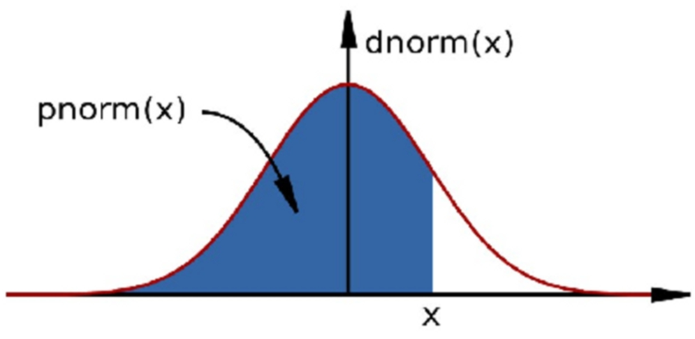

Reproducible R
========================================================
author: MRC Clinical Sciences Centre
autosize: true
font-import: <link href='http://fonts.googleapis.com/css?family=Slabo+27px' rel='stylesheet' type='text/css'>
font-family: 'Slabo 27px', serif;
css:style.css

Reproducible Research
========================================================
  
  
  
>"Let us change our traditional attitude to the construction of programs: Instead of imagining that our main task is to instruct a computer what to do, let us concentrate rather on explaining to humans what we want the computer to do."
 -- Donald E. Knuth, Literate Programming, 1984
 

Reproducible Research in R
========================================================

Try to think:
Sometime in the future, I, or my successor, will need to understand what analysis i did here.


Sweave and Latex
===============


knitr
=======

The **knitr** packages is the main route to create markdown from various flavours of R scripts.


Getting Started with making dynamic documents.
===============================================

From Scripts to Notes
======================

Defaults
====
Several packages offer methods to create notes from R scripts.

One of the simplest way to create a note in R is to use the **render()** function in **rmarkdown** package.


```r
library(rmarkdown)
render("scripts/script.r")
```

Output from render()
====

By default the render() function will have created a html file in the current working directory.

Have a look at the result script.html in the 
scripts directory. 


Controlling the output type from render()
====

The render()  function takes the argument **output_format**


```r
render("scripts/script.r", output_format="pdf_document")
```

Setting output directory for rendered documents
====

The arguments **output_file** and **output_dir** can be used to control where out put is rendered to.

Note that file extension must be supplied.


```r
render("scripts/script.r", output_format="pdf_document", output_file="myRenderedDoc.html",output_dir="scripts")
```


Adding comments and text.
===

In R we can use **#** as comments in the code. This is the most basic type of documentation for your code.


```r
# Generate some random numbers
myRandNumbers <- rnorm(100,10,2)
```

Adding comments and text.
===

If we want to include comments as text then we can use a new comment type **#'**  


```r
#' this would be placed as code
# Generate some random numbers
myRandNumbers <- rnorm(100,10,2)
```

YAML metadata.
===

If we wish to control author, title and date, we can insert metadata into the script as YAML.


```r
#' ---
#' title: "CWB making notes example"
#' author: "Tom Carroll"
#' date: "Day 3 of CWB"
#' ---
#' this would be placed as code
# Generate some random numbers
myRandNumbers <- rnorm(100,10,2)
```

Controlling R code evaluation in notes.
===
We can control how the output from R looks in our rendered documents.

Options are passed to R code by adding a line preceeding R code with the special argument **#+**. We will look at some options later but a useful example is fig.height and fig.width to control fig height and width.


```r
#' Some comments for text.
#+ fig.width=3, fig.height=3
myRandNumbers <- rnorm(100,10,2)
hist(myRandNumbers)
```

Exercise
========

Exercise using R studio
========================

Markdown
===============

Under the hood, R is creating an intermediate document in **Markdown** format.

Markdown is a mark up language containing plain text and allowing for conversion to multiple document types.

Common formats markdown renders to are - 
- html
- pdf
- Word

Markdown
===============

Markdown is often used as an intermediate document in conversion from one type to another.  

Markdown is in someplaces used as the main document type itself. 

Github makes use of Markdown syntax in it's Readme files and renders these with its own style.

https://github.com/github/markup/blob/master/README.md

Markdown syntax.
======

Markdown uses simple syntax to control text output.

This allows for the inclusion of font styles, text structures, images and code chunks.

Lets look at some simple syntax for markdown.

Markdown syntax- New line
======

Markdown is written as free text so often ignores new lines. 

To include a new line in markdown, end the previous line with two spaces.

```
This is my first line.  # comment shows line end
This would be a new line.
This wouldn't be a new line.

```
Markdown syntax- Font emphasis
======
Emphasis can be added to text in markdown documents using either the **_** or __*__


```r
Italics = _Italics_ or *Italics*
Bold  =  __Bold__ or **Bold**
```
Markdown syntax- Including external images
======
Figures or external images can be used in Markdown documents.  
Files may be local or accessible from http URL.

```



```

Markdown syntax- Creating section headers
======

Section headers can be added to Markdown documents. Headers follow the same conventions as used in HTML markup and can implemented be at 3 levels of size.  
Section headers in Markdown are created by using the **#** symbol

```
# Top level section
## Middle level section
### Bottom level section
```

Markdown syntax- Lists
======
Lists can be created in Markdown using the __*__ symbol.  
Nested lists be specified with **+** symbol.

```
* First item
* Second item
+ Second item A
+ Second item B
```
Markdown syntax- Order lists
=====

Lists can also include ordered numbers.

```
1. First item
2. Second item
+ Second item A
+ Second item B
```

Markdown syntax- Code chunks
======

In Markdown, text may be highlighted as if code by placing the text between '''.

```
The code used to produce plot was
'''
hist(rnorm(100))
'''

```
Markdown syntax- Code chunks
======

In Markdown, text may be highlighted as if code by placing the text between '''.

```
The code used to produce plot was
'''
hist(rnorm(100))
'''

```


Markdown syntax- HTML links
======
HTML links can be included in Markdown documents either by simple including address in text or by using **[]** for the phrase to add link to followed the link in **()**
```
http://mrccsc.github.io
[Github site](http://mrccsc.github.io)
```

Markdown syntax- Page breaks.
======
Markdown allows for the specification of page breaks in your document.  
To specify a page break use 3 or more asterisks or dashes.

```
Before the first page break
***
Before the second page break
---
```

rMarkdown.
=======

rMarkdown is a special case of Markdown used in R to allow for the generation of Markdown from R scripts. rMarkdown files will typically have the extension **.rmd**

rMarkdown allows for the inclusion of Markdown syntax around **chunks** of R code.

The output from running the R code can be tightly controled using rMarkdown, allowing for very neat integration of results with code used to generate them

rMarkdown. From Markdown to rMarkdown
=======

The transition Markdown to rMarkdown is very simple. All Markdown syntax may be included and code to be evaluated in R placed between a special code chunk.  
The code chunck is specified to include R to be run by the **{r}**

```
My Markdown **syntax** here
'''{r} 
Code to Run
'''

rMarkdown. Controlling R code output - eval
=======
Options may be included in the R code chunks. 

An import option is to choose whether code will be run or is meant for display only. This can be controlled with the **eval** option.

```

'''{r,eval=F} 
Code to Run
'''

```

rMarkdown. Hiding code.
=======

It may be that you wish to report just the results and not include the code used to generate them. This can be controlled with the **echo** argument.

```

'''{r,echo=F} 
Code to Run
'''

```

rMarkdown. Controlling R code output - message and warnings
=======
R can produce a lot of output not related to your results. To control whether messages and warnings are reported in the rendered document we can specify the **message** and **warning** arguments. 

Loading libraries in rMarkdown is often somewhere you would specify these.

```

'''{r,warning=F,message=F} 
library(ggplot2)
'''

```
rMarkdown. Controlling figure output.
=======

Control over figure heights and widths can be implemented in rMarkdown using the **fig.width** and **fig.height** arguments. Further control over exact size in rendered document maybe specified with **out.width** and **out.height**.

```

'''{r,fig.width=5,fig.height=5} 
hist(rnorm(100))
'''

```

rMarkdown. Automatically tidying code.
=======

The code within the **{r}** code block can be reformatted using the formatR package. This can be automatically done when the **tidy** option is specified.

```

'''{r,tidy=T} 
hist(rnorm(100))
'''

```
rMarkdown. Placing code and output together
=======

The code within the **{r}** code block will by default appear in a separate block to results output. To force code and output to appear in the same block the **collapse** option should be specified 
```

'''{r,collapse=T} 
temp <- rnorm(10)
temp
'''

```

rMarkdown. Inserting tables.
=======

The results of printing data frames or matrices in the console aren't neat.

We can insert HTML tables into Markdown by setting the **results** option to **asis** and using the knitr function **kable()**

```

'''{r,results='asis'} 
temp <- rnorm(10)
temp2 <- rnorm(10)
dfExample <- cbind(temp,temp2)
kable(dfExample)
'''

```
rMarkdown. Evaluating code in markdown.
=======

In may be useful to report the results of R within the block of Markdown. This can be done adding the code to evalulate within **'r '**

```
Here is some freeform _markdown_ and the first result from an rnorm call is 'r rnorm(3)[1]'

```
cache
==


Using Rstudio
===


Adding styles
===

Self contained documents
=====


More flavours of markdown.
===

